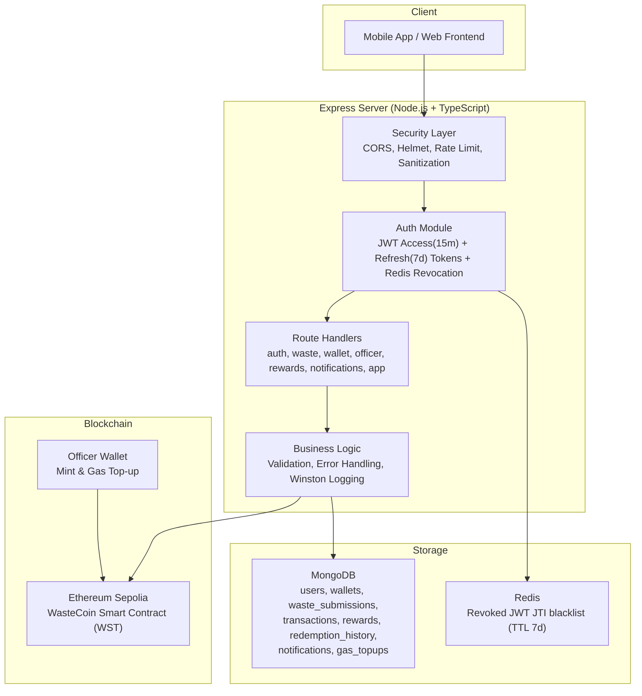
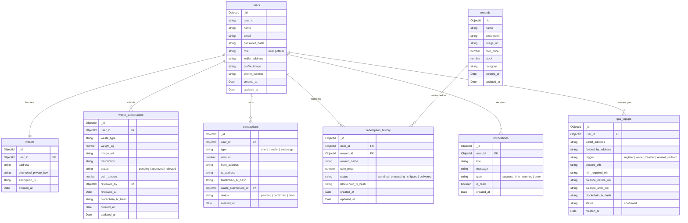
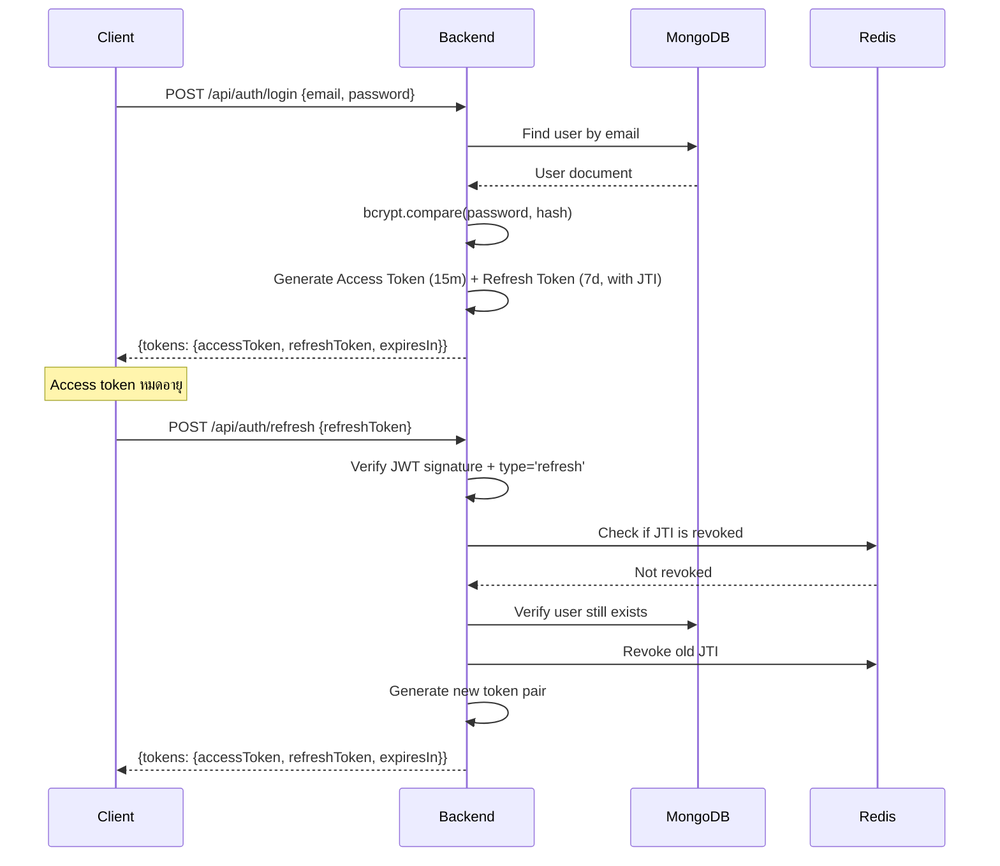
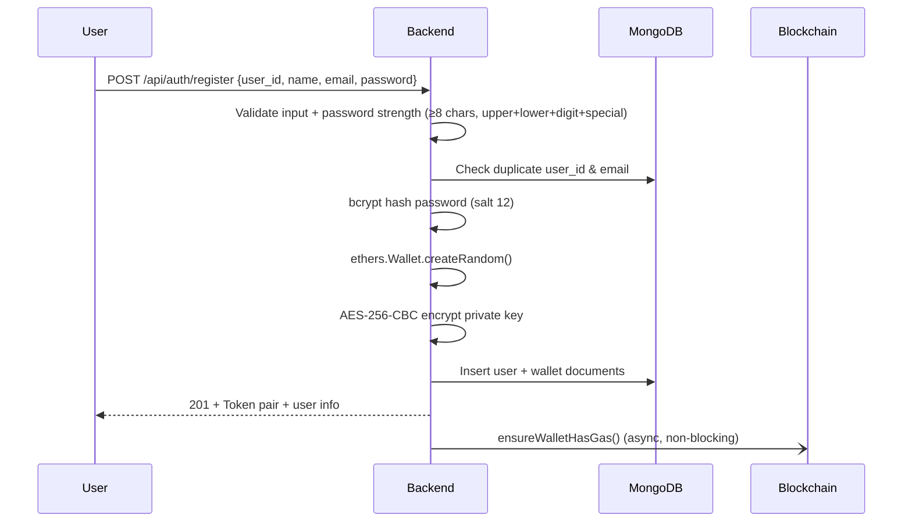
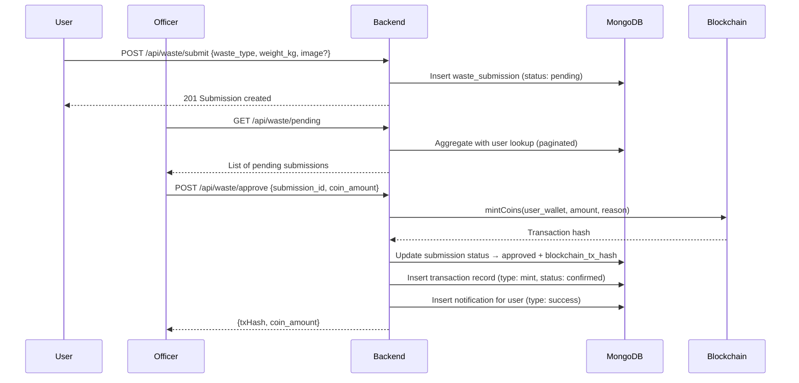
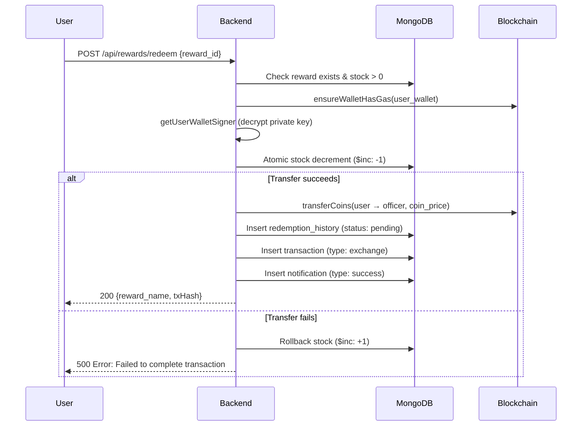

# 📖 WasteCoin Backend — System Walkthrough

> อัปเดตล่าสุด: มิถุนายน 2026 (ตรวจสอบจาก source code จริง)

## Overview

**WasteCoin** เป็นแพลตฟอร์มจัดการขยะที่ให้รางวัลเป็น cryptocurrency (WST token) แก่ผู้ใช้ที่ส่งขยะ ระบบ backend นี้ทำหน้าที่เป็นตัวกลางระหว่าง Mobile App/Web Frontend, MongoDB, Redis และ Ethereum Sepolia blockchain

> [!IMPORTANT]
> ระบบนี้เป็น **custodial wallet** — private key ของผู้ใช้ถูกเข้ารหัส (AES-256-CBC) และเก็บไว้ในฐานข้อมูล ผู้ใช้ไม่จำเป็นต้องจัดการ key เอง

---

## Architecture Diagram



---

## Tech Stack

| Component | Technology | Version |
|---|---|---|
| Runtime | Node.js | — |
| Language | TypeScript | ^5.8.2 |
| Web Framework | Express | ^4.21.2 |
| Database | MongoDB (native driver) | ^7.1.0 |
| Cache / Token Store | **Redis (ioredis)** | ^5.x |
| Blockchain | ethers.js | ^6.16.0 |
| Auth | JWT (jsonwebtoken) + bcryptjs | ^9.0.3 / ^3.0.3 |
| Security | Helmet + express-rate-limit | ^8.1.0 / ^8.3.2 |
| File Upload | **Multer** | ^1.4.5 |
| Logging | Winston | ^3.19.0 |
| Validation | express-validator + custom | ^7.3.2 |
| Deployment | Docker + Docker Compose | — |

---

## Source Code Structure

```
src/
├── index.ts                    # Entry point — Express app setup, middleware, routes
├── models/
│   └── types.ts                # TypeScript interfaces for all data models
├── lib/
│   ├── config.ts               # Environment config validation & caching
│   ├── mongodb.ts              # MongoDB connection singleton
│   ├── db-indexes.ts           # MongoDB index definitions (run at startup)
│   ├── redis.ts                # Redis client singleton (token revocation)
│   ├── auth.ts                 # JWT token pair generation/verification (uses Redis)
│   ├── auth-middleware.ts      # authMiddleware + officerMiddleware (RBAC)
│   ├── blockchain.ts           # ethers.js integration: mint, transfer, gas top-up
│   ├── wallet.ts               # Wallet creation, encrypt/decrypt private keys
│   ├── upload.ts               # Multer middleware + file save helper
│   ├── security.ts             # Helmet, sanitization, IP blocking, request logging
│   ├── validation.ts           # Input validation helpers
│   ├── response.ts             # Standardized API response helpers
│   ├── error-handler.ts        # ApiError class + global error handler middleware
│   ├── rate-limit.ts           # Rate limiter configurations
│   └── logger.ts               # Winston logger setup
└── routes/
    ├── auth.ts                 # Register, Login, Refresh, Logout
    ├── waste.ts                # Submit waste (+ image upload), My submissions, Pending, Approve
    ├── wallet.ts               # Balance, Info, Transfer, Export
    ├── officer.ts              # Add coins, View transactions (limit 50), Rewards report
    ├── rewards.ts              # List, Redeem, History, CRUD (officer)
    ├── users.ts                # Profile, Change password, List users
    ├── app.ts                  # Dashboard, Verify identity, Change password
    ├── transactions.ts         # Transaction history (limit 20)
    └── notifications.ts        # Get, Mark read, Mark all read
```

---

## Data Models (MongoDB Collections จาก types.ts จริง)



---

## Security Architecture

### 5-Layer Security Stack

| Layer | Component | Details |
|---|---|---|
| **1. Network** | CORS | Allowlist จาก `CORS_ORIGIN` env, development ยอมรับทุก origin |
| **2. Headers** | Helmet | CSP, HSTS (1 year + preload), X-Frame-Options: DENY, no-sniff, XSS filter |
| **3. Rate Limiting** | 3 ระดับ | General: 100 req/15min, Auth: 10 req/15min, API: 200 req/15min |
| **4. Application** | JWT + RBAC | Access Token 15 min, Refresh Token 7 วัน, Role: `user` / `officer` |
| **5. Token Revocation** | **Redis** | Revoked JTI เก็บใน Redis พร้อม TTL 7 วัน — ทนต่อ server restart |

### เพิ่มเติม
- **Input Sanitization** — ลบ `<script>`, `javascript:`, `onXxx=` ทั้ง query params และ body (recursive)
- **IP Blocking** — In-memory blocklist
- **Content-Type Validation** — POST/PUT/PATCH ต้องเป็น `application/json`
- **Body Size Limit** — 100KB max
- **Password Policy (register)** — ≥8 chars, uppercase, lowercase, digit, special char, bcrypt salt 12 rounds
  > [!WARNING]
  > `POST /api/users/change-password` และ `POST /api/app/change-password` ตรวจเพียง min 6 chars — ไม่มี strength check

### Token Flow



> [!NOTE]
> Revoked token list เก็บใน **Redis** พร้อม TTL อัตโนมัติ — ทนต่อ server restart  
> หาก Redis ไม่พร้อมใช้งาน server จะ throw error ตอน startup (initRedis() บังคับ)

---

## Critical Improvements (2026-06-16)

### 🔴 #1 — Redis Token Revocation

**ปัญหาเดิม:** Revoked tokens เก็บใน in-memory `Map` — หายทุกครั้งที่ restart server  
**แก้ไข:** ใช้ Redis (`ioredis`) เก็บ revoked JTI พร้อม TTL 7 วัน

| ไฟล์ | การเปลี่ยนแปลง |
|---|---|
| `src/lib/redis.ts` | Redis singleton: `initRedis`, `closeRedis`, `redisRevokeToken`, `redisIsTokenRevoked` |
| `src/lib/auth.ts` | `revokeToken`, `verifyRefreshToken`, `refreshAccessToken` เปลี่ยนเป็น `async` ใช้ Redis |
| `src/routes/auth.ts` | เพิ่ม `await` ทุก async token calls |
| `src/index.ts` | เรียก `initRedis()` ตอน startup, `closeRedis()` ตอน graceful shutdown |
| `docker-compose.yml` | เพิ่ม `redis:7-alpine` service + `redis_data` volume |
| `.env.example` | เพิ่ม `REDIS_URL` |

---

### 🔴 #2 — MongoDB Indexes

**ปัญหาเดิม:** ไม่มี index — query ช้าเมื่อข้อมูลเยอะ  
**แก้ไข:** สร้าง index ทุก collection ตอน server startup (idempotent)

| Collection | Indexes |
|---|---|
| `users` | `email` (unique), `user_id` (unique) |
| `wallets` | `user_id` (unique), `address` (unique) |
| `waste_submissions` | `{user_id, created_at}`, `{status, created_at}` |
| `transactions` | `{user_id, created_at}`, `blockchain_tx_hash` (sparse) |
| `notifications` | `{user_id, is_read, created_at}` |
| `redemption_history` | `{user_id, created_at}` |
| `gas_topups` | `{user_id, created_at}` |

| ไฟล์ | การเปลี่ยนแปลง |
|---|---|
| `src/lib/db-indexes.ts` | `ensureIndexes(db)` — สร้าง index ทั้งหมด |
| `src/index.ts` | เรียก `ensureIndexes()` หลัง connect MongoDB |

---

### 🔴 #3 — Image Upload (Multer)

**ปัญหาเดิม:** `POST /api/waste/submit` รับแค่ `image_url` string  
**แก้ไข:** รับไฟล์จริงผ่าน `multipart/form-data` — backward compatible กับ `image_url`

**พฤติกรรม:**
- ถ้าส่งไฟล์ `image` field → บันทึกลง disk ด้วย UUID filename, เก็บ path
- ถ้าส่ง `image_url` string → ตรวจด้วย `isSafeUrl()` (block localhost, private IP, cloud metadata)
- ไฟล์ที่รองรับ: JPEG, PNG, WebP
- ขนาดสูงสุด: ตาม `UPLOAD_MAX_SIZE_MB` (default 5MB)

| ไฟล์ | การเปลี่ยนแปลง |
|---|---|
| `src/lib/upload.ts` | Multer config (memory storage), `saveUploadedFile()` |
| `src/routes/waste.ts` | `/submit` ใช้ `upload.single('image')` middleware |
| `src/index.ts` | serve static `/uploads` → `public/uploads/` |
| `docker-compose.yml` | เพิ่ม `uploads_data` volume |
| `.env.example` | เพิ่ม `UPLOAD_MAX_SIZE_MB`, `UPLOAD_DIR` |

**API ใหม่ (backward compatible):**
```
POST /api/waste/submit
Content-Type: multipart/form-data

Fields:
  waste_type    string   (required)
  weight_kg     number   (required)
  description   string   (optional)
  image         file     (optional — JPEG/PNG/WebP, max 5MB)
  image_url     string   (optional — ถ้าไม่ upload file)
```

## Core Business Flows

### 1. 🔐 Registration Flow



### 2. ♻️ Waste Approval Flow (Core Business)



### 3. 🎁 Reward Redemption Flow



> [!TIP]
> การ redeem ใช้ **optimistic concurrency** — reserve stock ก่อน แล้ว rollback ถ้า blockchain transfer ล้มเหลว

### 4. 💸 Wallet Transfer Flow

1. ตรวจ Ethereum address validity + ป้องกัน self-transfer
2. `ensureWalletHasGas()` — เติม ETH จาก officer wallet ถ้า gas ต่ำกว่า threshold
3. Decrypt user private key → สร้าง signer
4. `transferCoins()` ผ่าน smart contract (`contract.transfer()`)
5. บันทึก transaction record (type: transfer)

### 5. ⛽ Auto Gas Top-up Flow

```
Trigger Points:
  1. register        → non-blocking async (ไม่หยุดรอ response)
  2. wallet_transfer → blocking (ต้องรอก่อนโอน)
  3. reward_redeem   → blocking (ต้องรอก่อนแลก)

Flow:
  ensureWalletHasGas(userId, address, trigger)
    │
    ├── getBalance(address) ── Blockchain
    ├── ถ้า balance >= WALLET_MIN_GAS_BALANCE_ETH → return { funded: false }
    └── ถ้า balance < threshold:
        ├── officer wallet sendTransaction(value=WALLET_GAS_TOP_UP_AMOUNT_ETH)
        ├── รอ receipt confirm
        ├── getBalance(address) อีกครั้ง
        └── บันทึก GasTopUpLog ใน MongoDB (พร้อม balance_before/after_wei)
```

---

## API Routes Summary

### 🔓 Public Endpoints

| Method | Path | Description |
|---|---|---|
| `GET` | `/health` | Health check (status, env, timestamp) |
| `GET` | `/ready` | Readiness check (ping MongoDB) |
| `POST` | `/api/auth/register` | สมัครสมาชิก + สร้าง wallet |
| `POST` | `/api/auth/login` | เข้าสู่ระบบ |
| `POST` | `/api/auth/refresh` | Refresh token pair |
| `POST` | `/api/auth/logout` | Revoke refresh token |

### 🔒 Authenticated User Endpoints

| Method | Path | Description | หมายเหตุ |
|---|---|---|---|
| `POST` | `/api/waste/submit` | ส่งข้อมูลขยะ | multipart/form-data หรือ JSON |
| `GET` | `/api/waste/my-submissions` | ดูรายการที่ตัวเองส่ง | paginated (default 20) |
| `GET` | `/api/wallet/balance` | ดูยอด WST token | raw response format |
| `GET` | `/api/wallet/info` | ดูข้อมูล wallet + user | raw response format |
| `POST` | `/api/wallet/transfer` | โอนเหรียญ | raw response format |
| `GET` | `/api/wallet/export` | Export private key | ต้อง ENABLE_WALLET_EXPORT=true |
| `GET` | `/api/transactions/history` | ดูประวัติ transaction | limit 20 (hardcoded) |
| `GET` | `/api/users/profile` | ดูโปรไฟล์ + stats | raw response format |
| `PUT` | `/api/users/profile` | แก้ไขโปรไฟล์ | name, profile_image, phone_number |
| `POST` | `/api/users/change-password` | เปลี่ยนรหัสผ่าน | currentPassword + newPassword |
| `GET` | `/api/app/dashboard` | Dashboard (profile + wallet + 5 txns) | raw response format |
| `POST` | `/api/app/verify-identity` | ยืนยัน password | raw response format |
| `POST` | `/api/app/change-password` | เปลี่ยนรหัสผ่าน (app version) | old_password + new_password |
| `GET` | `/api/rewards/list` | ดูรายการรางวัล | paginated, filter ?category= |
| `POST` | `/api/rewards/redeem` | แลกรางวัล | |
| `GET` | `/api/rewards/history` | ดูประวัติการแลก | paginated |
| `GET` | `/api/notifications` | ดูแจ้งเตือน | ไม่ paginated |
| `PUT` | `/api/notifications/:id/read` | อ่านแจ้งเตือน | ตรวจ ownership |
| `PUT` | `/api/notifications/read-all` | อ่านทั้งหมด | |

### 👮 Officer-Only Endpoints

| Method | Path | Description | หมายเหตุ |
|---|---|---|---|
| `GET` | `/api/waste/pending` | ดูรายการขยะ pending | paginated + user lookup |
| `POST` | `/api/waste/approve` | อนุมัติ + mint เหรียญ | |
| `POST` | `/api/officer/add-coins` | Mint เหรียญให้ user โดยตรง | return 201 |
| `GET` | `/api/officer/transactions` | ดู transactions ทั้งหมด | limit 50 (hardcoded), ไม่ paginated |
| `GET` | `/api/officer/rewards/report` | inventory + redemption history | |
| `GET` | `/api/users/list` | ดูรายชื่อ users (role=user เท่านั้น) | ไม่ paginated |
| `POST` | `/api/rewards/add` | เพิ่มรางวัลใหม่ | return 201 |
| `PUT` | `/api/rewards/update/:id` | แก้ไขรางวัล | partial update |
| `DELETE` | `/api/rewards/delete/:id` | ลบรางวัล | |

---

## Blockchain Integration

### Smart Contract (WasteCoin / WST)

- **Network**: Ethereum Sepolia Testnet
- **Token Standard**: ERC-20-like with custom `mintCoins` function
- **ABI Functions used**: `balanceOf`, `transfer`, `mintCoins`
- **ABI Events**: `CoinsMinted`, `Transfer`
- **Decimals**: 18 (ใช้ `ethers.parseEther` / `ethers.formatEther`)

### Gas Management

ระบบมี **auto gas top-up** — เมื่อผู้ใช้ต้องทำ transaction ระบบจะตรวจ ETH balance:
- ถ้า < `WALLET_MIN_GAS_BALANCE_ETH` (default: 0.0003 ETH)
- Officer wallet จะส่ง ETH ให้ = `WALLET_GAS_TOP_UP_AMOUNT_ETH` (default: 0.001 ETH)
- บันทึก log ลง `gas_topups` collection (รวม balance_before/after_wei)

**Triggers**:
- `register` — ตอนสมัครสมาชิก (async, non-blocking)
- `wallet_transfer` — ก่อนโอนเหรียญ (blocking)
- `reward_redeem` — ก่อนแลกรางวัล (blocking)

### Wallet Encryption

```
Private Key → AES-256-CBC encrypt → {encrypted_key, iv} → MongoDB
                    ↑
        SHA-256(ENCRYPTION_SECRET) = 32-byte key
```

---

## API Response Format

### Routes ที่ใช้ standardized format (auth, waste, rewards)
```json
{
  "success": true,
  "message": "Operation successful",
  "data": { ... },
  "meta": {
    "timestamp": "2026-06-17T04:00:00.000Z",
    "path": "/api/auth/register",
    "method": "POST"
  }
}
```

### Paginated response
```json
{
  "success": true,
  "message": "...",
  "data": [...],
  "pagination": {
    "page": 1,
    "limit": 20,
    "total": 100,
    "totalPages": 5,
    "hasNext": true,
    "hasPrev": false
  },
  "meta": { ... }
}
```

### Routes ที่ใช้ raw format (wallet, users, app, notifications, transactions)
```json
{ "field": "value", ... }
```

> [!WARNING]
> Response format ไม่สม่ำเสมอทั้งระบบ — wallet/users/app/notifications/transactions routes ยังใช้ raw `res.json()` ไม่ใช่ `successResponse()`

---

## Deployment

### Docker

```yaml
# docker-compose.yml services:
services:
  backend:   # Port 3000, health check /health, depends_on redis (healthy)
  redis:     # redis:7-alpine, appendonly yes, persistent volume
  frontend:  # Port 3001, depends_on backend (healthy)
```

- Backend `REDIS_URL` ใน docker-compose hardcoded เป็น `redis://redis:6379`
- Volumes: `redis_data` (token revocation), `uploads_data` (waste images)
- Network: `waste-coin-network` (bridge)

### Server Startup Sequence

```
1. validateConfig()     — reject default JWT/Encryption secrets, validate env
2. connectToDatabase()  — MongoDB
3. ensureIndexes(db)    — สร้าง indexes (idempotent, ไม่ crash ถ้า fail)
4. initRedis()          — Redis (throw + exit ถ้า fail)
5. app.listen(PORT)     — HTTP server
6. SIGTERM/SIGINT       — graceful: server.close() → closeRedis() → exit(0)
7. uncaughtException    — log + exit(1)
8. unhandledRejection   — log only
```

### Environment Variables

| Variable | Required | Default | Description |
|---|---|---|---|
| `MONGODB_URI` | ✅ | — | MongoDB connection string |
| `MONGODB_DB` | ❌ | `waste-coin-db` | Database name |
| `JWT_SECRET` | ✅ | — | ต้องไม่ใช่ค่า default |
| `ENCRYPTION_SECRET` | ✅ | — | สำหรับเข้ารหัส private key |
| `SEPOLIA_RPC_URL` | ✅ | — | Infura/Alchemy RPC URL |
| `WASTE_COIN_CONTRACT_ADDRESS` | ✅ | — | WST contract address |
| `OFFICER_PRIVATE_KEY` | ✅ | — | Private key ของ officer wallet |
| `CORS_ORIGIN` | ✅ (prod) | — | Comma-separated origins |
| `PORT` | ❌ | `3000` | Server port |
| `NODE_ENV` | ❌ | `development` | Environment |
| `ENABLE_WALLET_EXPORT` | ❌ | `false` | เปิด/ปิด export private key |
| `WALLET_MIN_GAS_BALANCE_ETH` | ❌ | `0.0003` | Threshold สำหรับ auto top-up |
| `WALLET_GAS_TOP_UP_AMOUNT_ETH` | ❌ | `0.001` | จำนวน ETH ที่เติมให้ |
| `REDIS_URL` | ❌ | `redis://localhost:6379` | Redis URL |
| `UPLOAD_MAX_SIZE_MB` | ❌ | `5` | ขนาดไฟล์สูงสุดที่อัปโหลดได้ |
| `UPLOAD_DIR` | ❌ | `public/uploads` | Path เก็บไฟล์ที่อัปโหลด |
| `LOG_LEVEL` | ❌ | `info` | Winston log level |
| `FRONTEND_PORT` | ❌ | `3001` | Frontend container port |
| `NEXT_PUBLIC_API_URL` | ❌ | `http://localhost:3000` | Backend URL สำหรับ frontend |

---

## Key Design Decisions

1. **Monolithic Architecture** — ทุก module อยู่ใน Express app เดียว แยกตาม domain (auth, waste, wallet, rewards)
2. **Custodial Wallet** — ผู้ใช้ไม่ต้องจัดการ key เอง แต่ backend ถือ private key (encrypted)
3. **MongoDB Native Driver** — ใช้ driver ตรง ไม่ใช้ ORM (Mongoose) เพื่อ performance & control
4. **Redis Token Revocation** — ใช้ Redis เก็บ revoked JTI พร้อม TTL ทนต่อ server restart
5. **Optimistic Stock Management** — Reserve stock ก่อน transfer, rollback ถ้าล้มเหลว
6. **Auto Gas Top-up** — Officer wallet เติม gas ให้ user อัตโนมัติ (async สำหรับ register, sync สำหรับ transfer/redeem)
7. **Inconsistent Response Format** — wallet/users/app/notifications/transactions ใช้ raw `res.json()` (ไม่ใช้ standardized format)
8. **Hardcoded Limits** — transactions history: limit 20; officer transactions: limit 50
9. **Image Upload (Multer)** — Memory storage → save ด้วย UUID filename → serve via `/uploads` static
10. **MongoDB Indexes at Startup** — `ensureIndexes()` รันตอน startup ทุกครั้ง (idempotent, ไม่ crash ถ้า fail)
